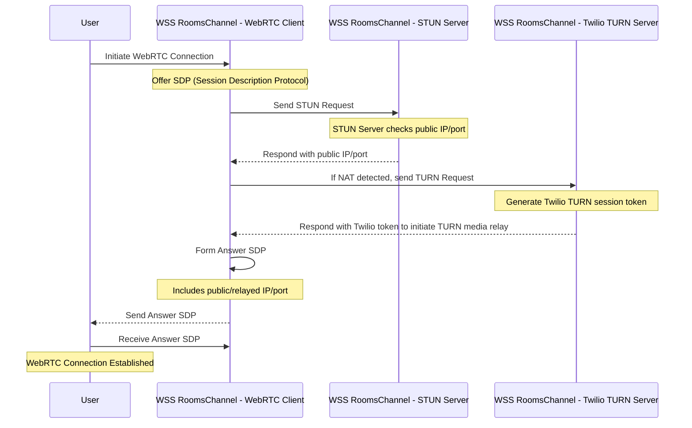

## My Experience as a Lead Software Engineer at MusicalOverture
I am excited to share my experience as a Lead Software Engineer at MusicalOverture. I joined the company in March 2020, just as the COVID-19 pandemic was starting to take hold. It was a challenging time, but it was also an incredibly rewarding experience.
## Building a Real-Time Audio/Video Collaboration Platform
My team was tasked with building a real-time audio/video collaboration platform for musicians. The goal was to create a platform that would allow musicians to practice and perform together with the lowest possible latency.
We used a variety of technologies to build the platform, including Ruby, Rails, MySQL, Redis, Sidekiq, WebSockets, ActionCable, and WebRTC. We also developed a Mesh-WebRTC implementation for free peer-to-multi-peer group audio/video call experiences.
## Managing a Remotely Distributed Team
One of the biggest challenges of the project was managing a remotely distributed team. We had team members in different time zones and in different countries. We had to find ways to communicate effectively and to stay on the same page.
We used a variety of tools to help us manage the team, including Slack, Zoom, and GitHub. We also created a strong culture of documentation and communication.
## The Challenges of Working During the Pandemic
At this point I had been working remotely, managing and leading development for companies from around the world for almost a decade. Pandemic work was no different except for the fact that many things I would typically do outside of the house were no longer available. Working with clients who had limited remote work experience was also a valuable experience. It helped me to refine and document my remote work style. For me documentation and communication are crucial for successful remote collaborations.
## The Rewards of Working on a Successful Project
Despite the challenges, I am incredibly proud of the work that we did on the MusicalOverture project. We were able to build a platform that has helped musicians connect and collaborate during a difficult time.
I also learned a lot from the experience. I learned how to manage a remotely distributed team, and I learned how to build a successful product in a challenging environment.
Conclusion
I am grateful for the opportunity to have worked on the MusicalOverture project. It was a challenging but rewarding experience, and I learned a lot from it. I am excited to see what the future holds for MusicalOverture, and I am proud to have been a part of it.

